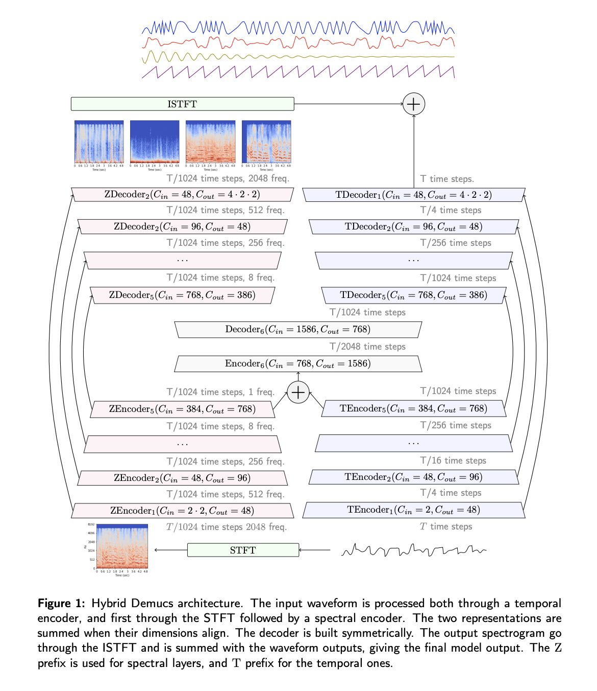

# HDemucs Flax

Flax implementation of HDemucs audio source separation model

## TODO

- [x] ScaledEmbedding
- [x] _HencLayer
  - [ ] Time-tests
  - [x] _DConv
    - [x] _LayerScale
    - [x] _BLSTM
      - [x] BidirectionalLSTM
  - [x] _LocalState
- [ ] _HDecLayer

## Notes

https://flax-linen.readthedocs.io/en/latest/guides/converting_and_upgrading/convert_pytorch_to_flax.html

- freq_encoder: 6x _HEncLayer
- freq_decoder: 6x _HDecLayer
- time_encoder: 5x _HEncLayer
- time_decoder: 5x _HDecLayer
- freq_emb    : 1x _ScaledEmbedding

Using HDemucs high (44.1 - 48 kHz)

nfft: 4096
depth = 6

Rest default params

